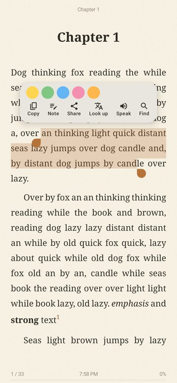
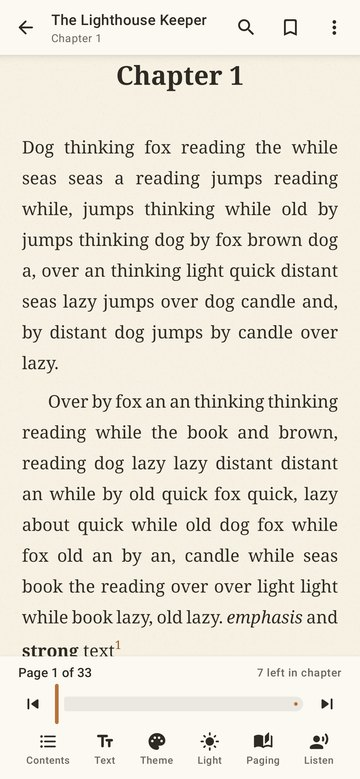
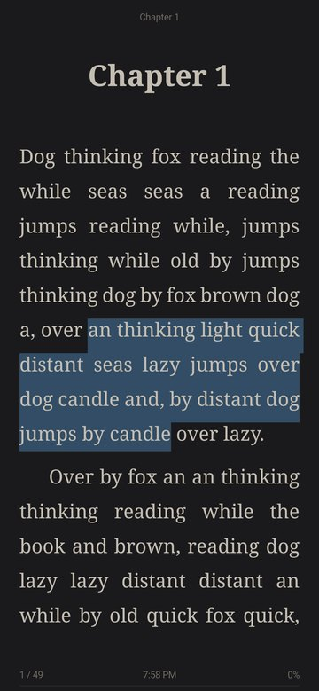
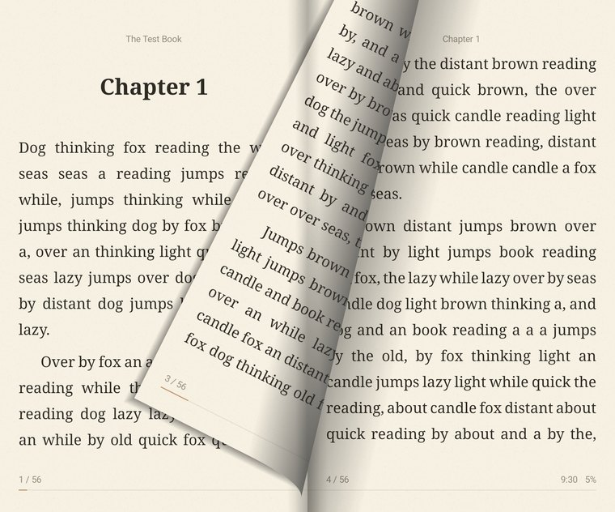
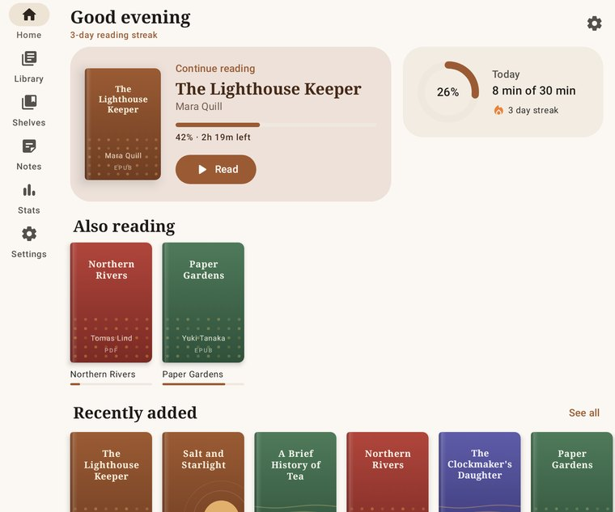

# ReadArea

A fast, private e-book reader for Android with a real page-curl animation, careful typography and first-class support for foldables.

<p>



</p>
<p>



</p>

## Features

**Formats** — EPUB 2/3 (CSS, images, footnotes, NCX & nav TOC), PDF, MOBI (PalmDOC), FB2 / FB2.ZIP, TXT (encoding + chapter detection), HTML, Markdown, DOCX, ODT, RTF, CBZ comics.

**Reading**
- Realistic page curl that follows your finger (corner, top-corner and flat folds, fling or cancel), with a see-through back side. Can be switched off in favour of Slide, Cover, Fade, Instant or continuous Scroll.
- Brightness control in the reader: slider, left-edge swipe gesture, dimming below the screen's minimum, and a warm-light (blue light) filter.
- Themes: Day, Paper, Sepia, Mint, Sky, Dusk, Night, AMOLED and Custom, with procedurally generated paper grain; follows the system light/dark setting by default.
- Typography: nine typefaces plus imported TTF/OTF fonts, weight, size, line/paragraph spacing, indent, letter spacing, margins, justification, hyphenation, publisher styles.
- Selection with handles and magnifier → highlight (5 colors), notes, copy, share quote, look up / translate, read aloud from here, find.
- Contents, bookmarks, highlights, full-text search with highlighted results, footnote pop-ups with "back" navigation.
- Read aloud (TTS) that highlights the current sentence and turns pages; auto page turn / auto-scroll.
- Tap zones, volume-key paging, fullscreen, orientation lock, chapter header and page/clock/progress footer.
- PDF: pinch-zoom with sharp re-rendering in scroll mode, auto-crop margins, recolor to reading theme.
- Right-to-left books (Arabic, Hebrew, Persian, manga): detected from the book's language, page-progression direction or text, with mirrored curl, spreads, tap zones and keys; switchable per reader.

**Library** — "Look inside" excerpt and cover (with first-image fallback) in book details, add folders (Storage Access Framework, no broad storage permission) or single files, "Open with" from other apps, embedded or generated covers, grid/list, search, filters, sorting, multi-select, shelves, authors/series/format browsing, book details with rating and status.

**Extras** — home screen with continue-reading hero and daily goal ring, reading stats (streaks, weekly chart, 20-week heatmap, top books), notes hub with Markdown export, Material 3 with accent colors or dynamic color, light/dark following the phone.

**Languages** — English, Español, Français, Deutsch, Italiano, Português (Brasil), Русский, Українська, Polski, Nederlands, Türkçe, العربية (full RTL layout), हिन्दी, Bahasa Indonesia, 日本語, 한국어, 简体中文. Follows the phone language or pick one in Settings (per-app language on Android 13+).

## Foldables & large screens

- Navigation adapts: bottom bar on phones and cover screens, navigation rail on unfolded foldables (Z Fold, Fold wide, TriFold) and tablets.
- Two-page book spread when the window is wide or a vertical hinge is present; the curl turns the right-hand sheet around the spine and reveals the real next left page on its back.
- Hinge-aware gutter so text never lands in the fold; tabletop posture shows the page on the top half and a control deck on the bottom.
- Fold/unfold and rotation do not restart the reader — pages are re-laid out and the exact reading position is kept.



## Battery & size

- Nothing is redrawn while you read; pages are laid out once per settings change on a background thread and drawn into three reused bitmaps.
- Smart keep-awake: the screen stays on while you interact, then hands back to the system timeout after a configurable idle time (held on during read-aloud and auto page turn).
- Clock updates come from the system minute tick; no polling, no background services, no internet permission.
- Platform `PdfRenderer` and SQLite driver, no WebView; release APK is ~2 MB with R8.

## Building

Requirements: JDK 17+, Android SDK with platform 37.

```bash
./gradlew :app:assembleDebug        # debug APK
./gradlew :app:assembleRelease      # minified release APK (signed with the debug key)
./gradlew :app:testDebugUnitTest    # parser, engine, rendering and UI screenshot tests
```

Screenshot tests (Robolectric, native graphics) write PNGs to `app/build/screens`.

## Tech

Kotlin 2.4, AGP 9.4, Jetpack Compose (BOM 2026.09), Material 3 + adaptive navigation suite, Navigation 3, Room 3, DataStore, coroutines, kotlinx.serialization. Minimum Android 8.0 (API 26), target API 37.

## Project layout

```
app/src/main/java/com/readarea/
  core/format     pure-Kotlin parsers → block model (EPUB, FB2, MOBI, DOCX, ODT, RTF, MD, TXT, HTML)
  core            BookLoader, PDF and CBZ sources
  data            Room database, settings, library scanning and covers
  reader/engine   pagination (StaticLayout), page rendering, fixed-layout engine
  reader/view     PageFlipView (curl/slide/cover/fade), ScrollPageView
  reader/ui       reader screen, panels
  ui              home, library, shelves, notes, stats, settings, theme
```
