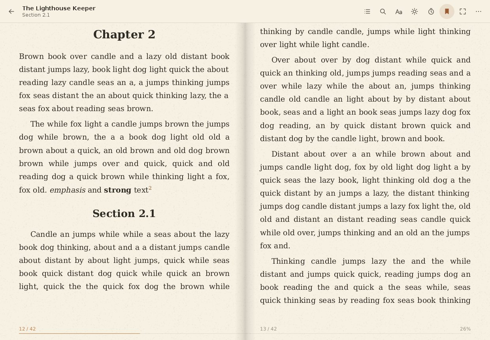
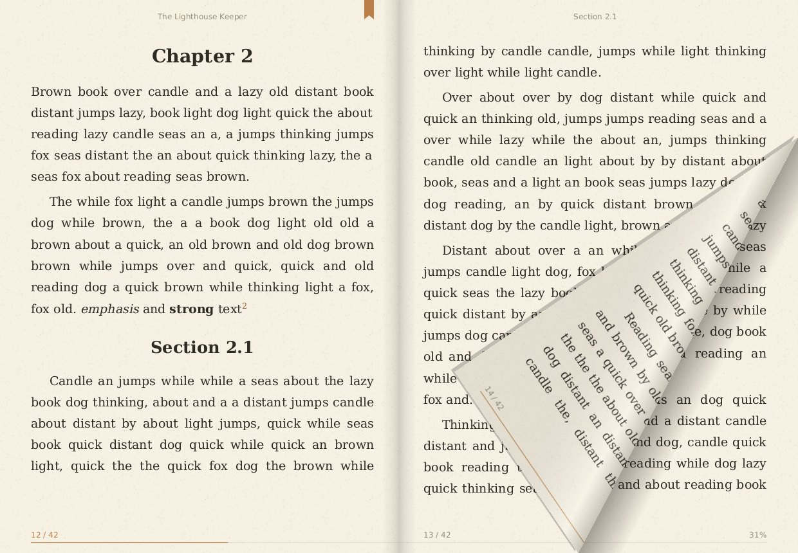
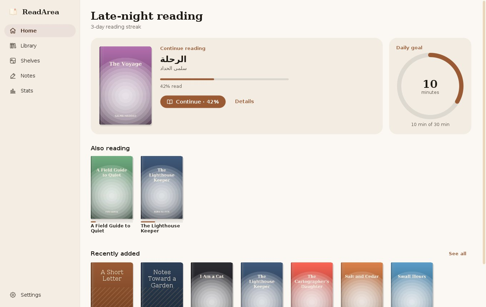
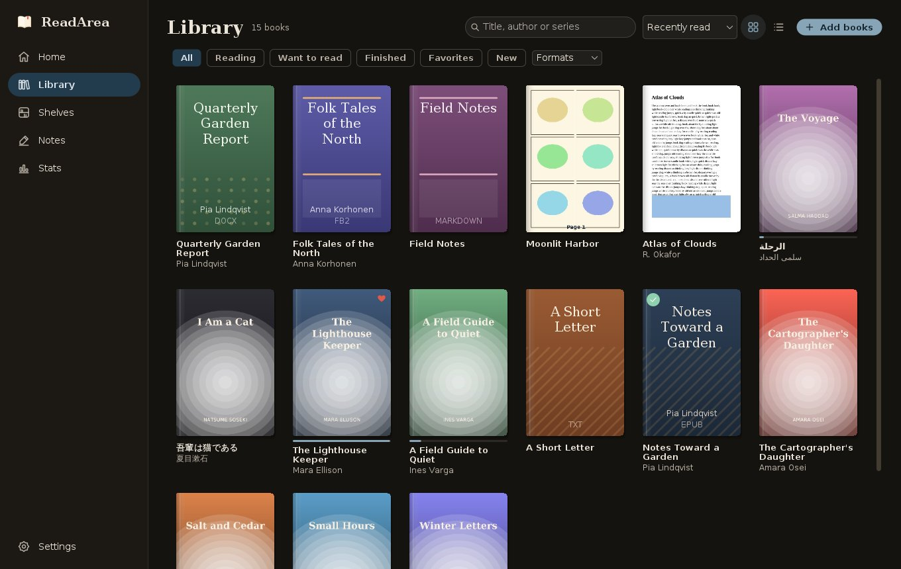

# ReadArea

**A beautiful, private e-book reader for Android, macOS, Windows and Linux.** Real page-turning, lovely typography, and your notes stay on your device. No ads, no accounts, no internet.

**[⬇ Download the latest version](https://github.com/EL4CTEO/ReadArea/releases/latest)**

<p>


</p>
<p>




</p>

## Install

Every release on the **[releases page](https://github.com/EL4CTEO/ReadArea/releases/latest)** has a download for each system. Updating is always the same: install the newer version over the old one. Your library, progress and notes are kept.

### Android

1. On your phone, open the latest release and tap `ReadArea-x.y.z.apk` to download it.
2. Open the downloaded file. If Android asks, allow your browser or file manager to **install unknown apps**.
3. Tap **Install**.

Needs Android 8.0 or newer.

### macOS

1. Download `ReadArea-x.y.z-macos-arm64.dmg` for Apple silicon (M1 and later) or `ReadArea-x.y.z-macos-x64.dmg` for Intel Macs.
2. Open it and drag **ReadArea** into **Applications**.
3. If macOS says it can't check the app for malicious software, open **System Settings → Privacy & Security** and click **Open Anyway**, or right-click ReadArea in Applications and choose **Open**. You only need to do this once.

### Windows

1. Download `ReadArea-x.y.z-windows-x64.msi` and open it. It installs just for you, without administrator rights, and adds ReadArea to the Start menu.
2. If Windows shows *Windows protected your PC*, click **More info → Run anyway**.

Prefer not to install? `ReadArea-x.y.z-windows-x64-portable.zip` runs from any folder: unzip it and open `ReadArea.exe`.

### Linux

- **Ubuntu, Debian, Mint:** `sudo apt install ./ReadArea-x.y.z-linux-x64.deb`
- **Fedora, openSUSE:** `sudo dnf install ./ReadArea-x.y.z-linux-x64.rpm`
- **Anything else:** unpack `ReadArea-x.y.z-linux-x64.tar.gz` and run `ReadArea/bin/ReadArea`.

On ARM computers (like a Raspberry Pi 5 or an ARM laptop), pick the `linux-arm64` files instead. For read aloud, install `espeak-ng` or `speech-dispatcher` if your system doesn't have one.

## Getting started

**On Android**

1. Tap **Find my books** and allow access. ReadArea lists every book on your phone, including downloads and files people sent you, and keeps the list up to date.
2. Prefer to choose? Tap **Add a folder** or **Open files** instead, or open a book from any file manager with **Open with → ReadArea**.
3. Tap a book to start reading. Tap the middle of a page to open the menu.
4. Close the app while reading and it opens straight back to your page next time.

**On a computer**

1. Add the folders where you keep your books in **Settings → Library folders**. ReadArea finds every book in them, subfolders included, and keeps watching them for new ones. You can also drop books or folders onto the window.
2. Double-click a book to read. E-books (EPUB, MOBI, FB2, comics) also open straight from Finder, Explorer or your file manager.
3. Turn pages with the arrow keys, the space bar, a click on either side, or by dragging a page corner. Click the middle of the page or press **Esc** for the tools.
4. Widen the window and the book opens into two pages side by side.

## What it can do

**Reading that feels like a book**
- A page curl that follows your finger, or slide, fade, instant and continuous scrolling if you prefer.
- Themes like Paper, Sepia, Night and AMOLED black, switching to dark automatically with your phone.
- Choose font, size, spacing and margins, or import your own fonts.
- Brightness right in the book: swipe along the left edge, dim below your screen's minimum, and add a warm light for bedtime.

**Notes and tools**
- Highlight in five colors, add notes and bookmarks, and export your notes.
- Search the whole book, and see footnotes in a pop-up without losing your place.
- Read aloud with the current sentence highlighted, while pages turn by themselves.
- Automatic page turning for hands-free reading.

**Your library**
- Every book shows its real cover, taken from the file itself. Books without one get a nicely designed cover.
- Shelves, favorites, ratings, and *Reading / Want to read / Finished*.
- Search, sort and filter, plus a *Look inside* preview.
- Reading stats: streaks, a daily goal and charts of your reading time.

**Foldables and tablets**
- Two pages side by side on unfolded phones (Galaxy Z Fold, Fold wide, TriFold) and tablets.
- Text never falls into the fold, and tabletop mode puts the page on top and the controls below.

**On your computer**
- Two-page spreads in wide windows, with a page curl you drag with the mouse.
- Keyboard shortcuts for everything: pages, chapters, search, bookmarks, contents, text size and full screen.
- Several books open at once, each in its own window, and your place kept in all of them.
- Reads aloud with the voices your computer already has.
- Looks at home on each system and follows its dark mode.

**Any language, any direction**
- The app speaks 17 languages, and the whole app mirrors for Arabic.
- Right-to-left books (Arabic, Hebrew, Persian, manga) turn pages the right way.
- Vertical Japanese and Chinese text, with furigana beside the characters.

**Light on your battery**
- A small download: under 3 MB on Android, and the desktop app brings everything it needs, so there's nothing else to install.
- Nothing is redrawn while you read.
- The screen stays on while you're reading, then sleeps normally. You choose how long.

## Supported formats

| Books | Documents | Comics |
| --- | --- | --- |
| EPUB, MOBI / AZW, FB2 | PDF, Word (DOCX), LibreOffice (ODT), RTF, TXT, Markdown, HTML | CBZ |

## Privacy

ReadArea never connects to the internet. There are no ads, no tracking and no accounts.

- It only reads files: on Android your whole storage if you use **Find my books**, otherwise just the folders you choose.
- Removing a book from the library never deletes the file unless you tick the box to do so.
- Your library, progress and notes stay on your device. On Android they're only included in Android's backup when that backup is end-to-end encrypted with your screen lock, and when you move to a new phone with a cable or Quick Share. On a computer they're in a folder only your user account can open:
  - macOS: `~/Library/Application Support/ReadArea`
  - Windows: `%LOCALAPPDATA%\ReadArea`
  - Linux: `~/.local/share/readarea`
- Books can't reach out: pictures only ever come from the book itself (or, for Markdown and HTML files, from the folder next to them), never from the web, and fonts inside books aren't loaded at all.
- Links inside books only open web pages and email, and always ask first, showing exactly where they go.
- Every book is treated as untrusted. A damaged or deliberately malicious file just fails to open; it can't hang or crash the app, or reach anything outside it. See [SECURITY.md](SECURITY.md).

## Questions

**Is it free?** Yes. It's open source under the MIT license.

**A book won't open.** Books bought from stores like Kindle or Kobo are usually DRM-protected, and no other reader app can open those.

**Where are my notes?** Only on your device. You can export them from the **Notes** tab.

**Can I change the app language?** Yes: **Settings → App language**. By default it follows your phone or computer.

**How do I remove the desktop app completely?** Uninstall it like any other app (drag it to the Trash on macOS, *Settings → Apps* on Windows, your package manager on Linux), then delete the data folder listed under Privacy. **Settings → Data folder** shows it.

<details>
<summary><b>For developers</b></summary>

### Layout

```
core/          Pure Kotlin, shared by every platform: the format parsers (EPUB, FB2, MOBI, DOCX, ODT, RTF,
               Markdown, TXT, HTML), the text and offset model behind progress, search, notes and read aloud,
               opening books from files, library rules and the reading themes.
app/           The Android app: Jetpack Compose, Room, a custom page engine and page-curl view.
desktop/       The macOS, Windows and Linux app: Swing with FlatLaf, a Java2D page engine (hyphenation,
               justification, bidi, ruby, vertical CJK), page curl, PDFBox and SQLite.
build-logic/   Gradle plugin that turns the desktop app into native installers.
```

Both apps read books through the same parsers into the same block model and measure positions in the same text offsets, so a highlight or bookmark means the same thing everywhere.

### Build and run

Needs JDK 21. The Android app also needs the Android SDK with platform 37; without one, the build simply leaves the Android module out.

```bash
./gradlew :desktop:run                     # the desktop app, with a separate development library
./gradlew :desktop:packageDesktop          # installers for this system, in desktop/build/package/dist
./gradlew :app:assembleDebug               # the Android app
```

Installers are built with the JDK's jpackage on each system: dmg on macOS, msi on Windows (needs WiX 3), deb and rpm on Linux (need `fakeroot` and `rpm`). Each build trims a Java runtime to what the app uses, checks the packaged app with `ReadArea --self-test` through its own launcher, and records a class-data archive for faster start-up (on Linux this needs a display, e.g. `xvfb-run`).

### Tests

```bash
./gradlew :core:test                                     # parsers, text model, library rules
xvfb-run -a ./gradlew :desktop:test                      # engine, rendering, UI walkthroughs, security
./gradlew :app:testDebugUnitTest                         # Android
READAREA_BENCH=1 ./gradlew :desktop:test --tests '*PerfBench*' -i   # timings, on demand
```

The desktop UI tests drive the real app on a virtual display, in English and in Arabic, and save screenshots of every screen to `desktop/build/qa-screens` and `qa-screens-rtl`. The security tests attack the parsers with hostile files (decompression bombs, deep nesting, malformed headers) and fuzz every format with thousands of damaged books. Rendering tests write PNGs to `app/build/screens` and `desktop/build/screens`.

`READAREA_TRACE_STARTUP=1` makes the desktop app print its start-up timings.

### Release

Running the **Release** workflow (Actions → Release → Run workflow) or pushing a tag like `v1.2.0` builds the signed APK and the desktop installers for every system, and publishes them with checksums as a GitHub Release. The Android version code is `major * 10000 + minor * 100 + patch`, so every newer version installs as an update.

Repository secrets (Settings → Secrets and variables → Actions):

- Android, required: `KEYSTORE_BASE64` (the keystore, base64-encoded), `KEYSTORE_PASSWORD`, `KEY_ALIAS` and `KEY_PASSWORD`. Keep a backup of the keystore: Android only accepts updates signed with the same key.
- macOS, optional: with `MACOS_CERTIFICATE` (a Developer ID Application certificate as base64 .p12), `MACOS_CERTIFICATE_PASSWORD`, `MACOS_SIGNING_IDENTITY` (e.g. `Jane Doe (TEAMID)`), `APPLE_ID`, `APPLE_TEAM_ID` and `APPLE_APP_PASSWORD`, the Mac apps are signed and notarized, so they open without warnings.

</details>
