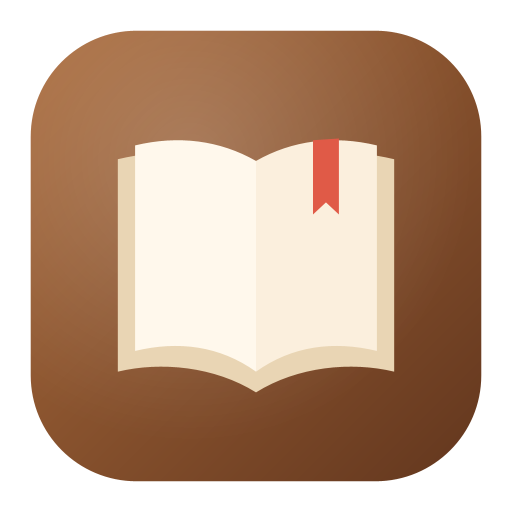

# ReadArea

**A private e-book reader for Android, macOS, Windows and Linux.** Real page turns and fine typography. No ads, no accounts, no internet.

**[⬇ Download the latest version](https://github.com/EL4CTEO/ReadArea/releases/latest)**

## Install

Each [release](https://github.com/EL4CTEO/ReadArea/releases/latest) has a download for every system. To update, install the new version over the old one: your library, progress and notes are kept.

- **Android** (8.0 or newer): download `ReadArea-x.y.z.apk`, open it and tap **Install**. If Android asks, allow your browser or file manager to *install unknown apps*. If Play Protect warns, tap **Scan app**, or **More details → Install anyway**.
- **macOS:** download the `.dmg` (`arm64` for Apple silicon, `x64` for Intel) and drag ReadArea into Applications. If macOS can't check the app, right-click it and choose **Open** (only the first time).
- **Windows:** download the `.msi` (installs just for you, no administrator rights) or the `-portable.zip` to run from any folder. If you see *Windows protected your PC*, click **More info → Run anyway**.
- **Linux:** `sudo apt install ./ReadArea-x.y.z-linux-x64.deb` (Ubuntu, Debian, Mint), `sudo dnf install ./ReadArea-x.y.z-linux-x64.rpm` (Fedora, openSUSE), or unpack the `.tar.gz` and run `ReadArea/bin/ReadArea`. Pick the `linux-arm64` files on ARM computers. For read aloud, install `espeak-ng` or `speech-dispatcher`.

## Getting started

**On your phone:** tap **Find my books** and allow access (or choose **Add a folder** or **Open files**). Tap a book to read, and tap the middle of a page for the menu. Close the app mid-book and it opens back on your page.

**On a computer:** add your book folders in **Settings → Library folders** (subfolders included, new books picked up automatically), or drop books onto the window. Double-click a book to read. Turn pages with the arrow keys, the space bar, a click on either side or by dragging a corner. Click the middle of the page or press **Esc** for the tools.

## What you get

- **Reads like a book:** page curl (or slide, fade, scroll), themes from Paper to AMOLED black, your font, size and margins, and brightness with a warm light.
- **Notes and tools:** highlights in five colors, notes, bookmarks, search, footnote pop-ups, read aloud and hands-free page turning.
- **Your library:** real covers, shelves, favorites, ratings, filters, and reading stats with streaks and a daily goal.
- **Big screens:** two-page spreads on tablets, foldables and wide windows. On a computer, keyboard shortcuts, several books open at once and your system's voices for read aloud.
- **Your language:** 17 app languages, right-to-left books, and vertical Japanese and Chinese with furigana.
- **Light:** under 3 MB on Android.

**Formats:** EPUB, MOBI / AZW, FB2, PDF, Word (DOCX), LibreOffice (ODT), RTF, TXT, Markdown, HTML and comics (CBZ).

## Privacy

ReadArea never connects to the internet. There are no ads, no tracking and no accounts.

- It only reads files: on Android your whole storage if you use **Find my books**, otherwise just the folders you choose. Removing a book never deletes its file unless you tick the box.
- Your library, progress and notes stay on your device. On Android they're backed up only when the backup is end-to-end encrypted with your screen lock, and carried over when you move to a new phone.
- Books can't reach out: their pictures come only from the book itself, and links ask before they open. A damaged or malicious file just fails to open. See [SECURITY.md](SECURITY.md).

## Questions

**Is it free?** Yes, and open source under the MIT license.

**A book won't open.** Books bought from stores like Kindle or Kobo are usually DRM-protected, and no other reader can open those either.

**Where are my notes?** Only on your device. Export them from the **Notes** tab.

**Can I change the language?** Yes: **Settings → App language**. It follows your phone or computer by default.

**How do I remove the desktop app completely?** Uninstall it like any other app, then delete the data folder shown in **Settings → Data folder**: `~/Library/Application Support/ReadArea` on macOS, `%LOCALAPPDATA%\ReadArea` on Windows, `~/.local/share/readarea` on Linux.

## Build it yourself

You need JDK 21 (and the Android SDK for the phone app). `./gradlew :desktop:run` starts the desktop app, `./gradlew :desktop:packageDesktop` builds an installer for your system and `./gradlew :app:assembleDebug` builds the Android app. More in [docs/DEVELOPING.md](docs/DEVELOPING.md).
