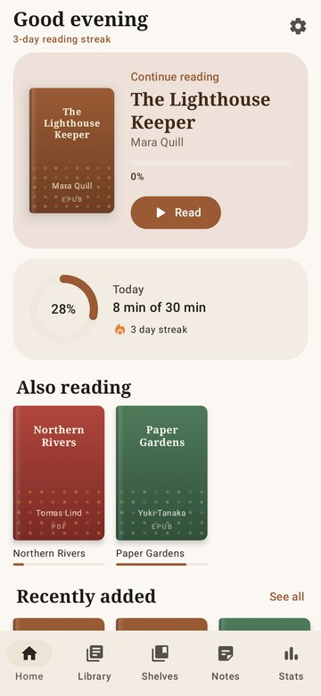
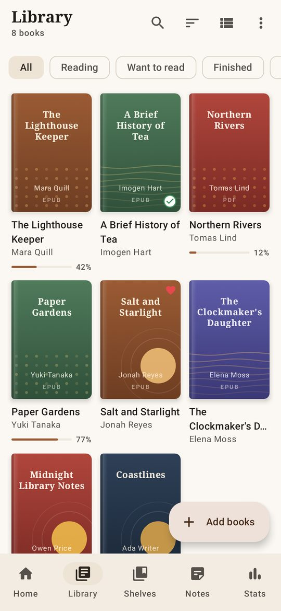
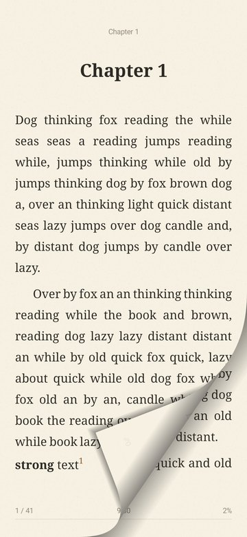
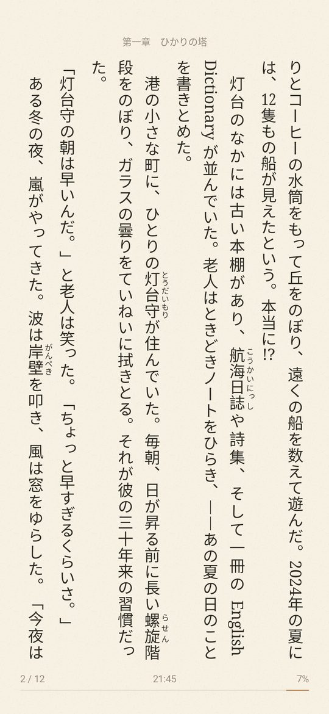

# ReadArea

**A beautiful, private e-book reader for Android.** Real page-turning, lovely typography, and your notes stay on your phone. No ads, no accounts, no internet.

**[⬇ Download the latest version](https://github.com/EL4CTEO/ReadArea/releases/latest)**

<p>




</p>

## Install

1. On your phone, open the **[latest release](https://github.com/EL4CTEO/ReadArea/releases/latest)** and tap `ReadArea-x.y.z.apk` to download it.
2. Open the downloaded file. If Android asks, allow your browser or file manager to **install unknown apps**.
3. Tap **Install**.

To update, install the newer APK the same way. Your library, progress and notes are kept.

Needs Android 8.0 or newer.

## Getting started

1. Tap **Find my books** and allow access. ReadArea lists every book on your phone, including downloads and files people sent you, and keeps the list up to date.
2. Prefer to choose? Tap **Add a folder** or **Open files** instead, or open a book from any file manager with **Open with → ReadArea**.
3. Tap a book to start reading. Tap the middle of a page to open the menu.
4. Close the app while reading and it opens straight back to your page next time.

## What it can do

**Reading that feels like a book**
- A page curl that follows your finger, or slide, fade, instant and continuous scrolling if you prefer.
- Themes like Paper, Sepia, Night and AMOLED black, switching to dark automatically with your phone.
- Choose font, size, spacing and margins, or import your own fonts.
- Brightness right in the book: swipe along the left edge, dim below your screen's minimum, and add a warm light for bedtime.

**Notes and tools**
- Highlight in five colors, add notes and bookmarks, and export your notes.
- Search the whole book, and see footnotes in a pop-up without losing your place.
- Read aloud with the current sentence highlighted, while pages turn by themselves.
- Automatic page turning for hands-free reading.

**Your library**
- Every book shows its real cover, taken from the file itself. Books without one get a nicely designed cover.
- Shelves, favorites, ratings, and *Reading / Want to read / Finished*.
- Search, sort and filter, plus a *Look inside* preview.
- Reading stats: streaks, a daily goal and charts of your reading time.

**Foldables and tablets**
- Two pages side by side on unfolded phones (Galaxy Z Fold, Fold wide, TriFold) and tablets.
- Text never falls into the fold, and tabletop mode puts the page on top and the controls below.

**Any language, any direction**
- The app speaks 17 languages.
- Right-to-left books (Arabic, Hebrew, Persian, manga) turn pages the right way.
- Vertical Japanese and Chinese text, with furigana beside the characters.

**Light on your battery**
- A small download, under 3 MB.
- Nothing is redrawn while you read.
- The screen stays on while you're reading, then sleeps normally. You choose how long.

## Supported formats

| Books | Documents | Comics |
| --- | --- | --- |
| EPUB, MOBI / AZW, FB2 | PDF, Word (DOCX), LibreOffice (ODT), RTF, TXT, Markdown, HTML | CBZ |

## Privacy

ReadArea has no internet access at all. There are no ads, no tracking and no accounts. It only reads files: it sees your whole storage if you use **Find my books**, or just the folders you choose otherwise, and you can turn that off in Settings. Removing a book from the library never deletes the file unless you ask. Everything you read, highlight or write stays on your phone.

## Questions

**Is it free?** Yes. It's open source under the MIT license.

**A book won't open.** Books bought from stores like Kindle or Kobo are usually DRM-protected, and no other reader app can open those.

**Where are my notes?** Only on your phone. You can export them from the **Notes** tab.

**Can I change the app language?** Yes: **Settings → App language**. By default it follows your phone.

<details>
<summary><b>For developers</b></summary>

### Build

Needs JDK 17+ and the Android SDK with platform 37.

```bash
./gradlew :app:assembleDebug
./gradlew :app:assembleRelease
./gradlew :app:testDebugUnitTest
```

The tests include rendering and UI screenshot tests that write PNGs to `app/build/screens`.

### Release

Running the **Release** workflow (Actions → Release → Run workflow) or pushing a tag like `v1.2.0` builds a signed APK and publishes it as a GitHub Release. The version code is `major * 10000 + minor * 100 + patch`, so every newer version installs as an update.

It needs four repository secrets under Settings → Secrets and variables → Actions: `KEYSTORE_BASE64` (the keystore, base64-encoded), `KEYSTORE_PASSWORD`, `KEY_ALIAS` and `KEY_PASSWORD`. Keep a backup of the keystore: Android only accepts updates signed with the same key.

### Tech

Kotlin, Jetpack Compose, Material 3 adaptive, Navigation 3, Room, DataStore. Pure-Kotlin parsers turn every format into one block model, which is paginated and drawn by a custom page engine with its own page-curl view.

```
app/src/main/java/com/readarea/
  core/format     parsers for EPUB, FB2, MOBI, DOCX, ODT, RTF, Markdown, TXT, HTML
  core            book loading, PDF and CBZ
  data            database, settings, library scanning, covers
  reader/engine   pagination and page drawing, including vertical text
  reader/view     page curl and scrolling views
  reader/ui       reader screen and menus
  ui              home, library, shelves, notes, stats, settings
```

</details>
